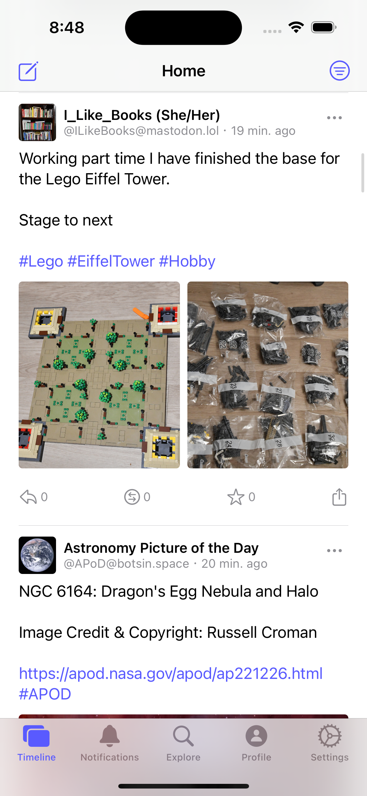
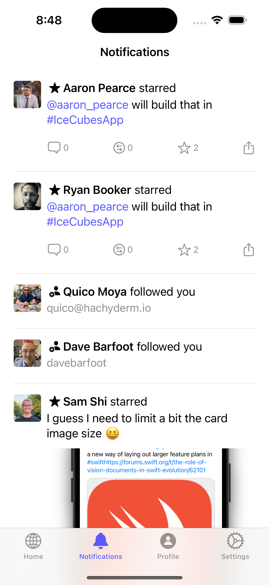
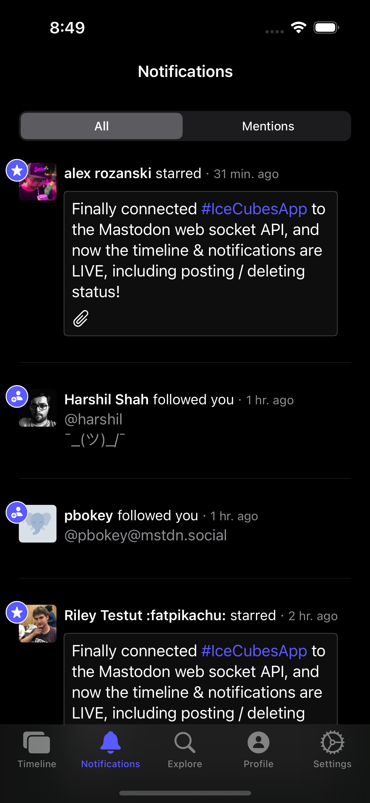
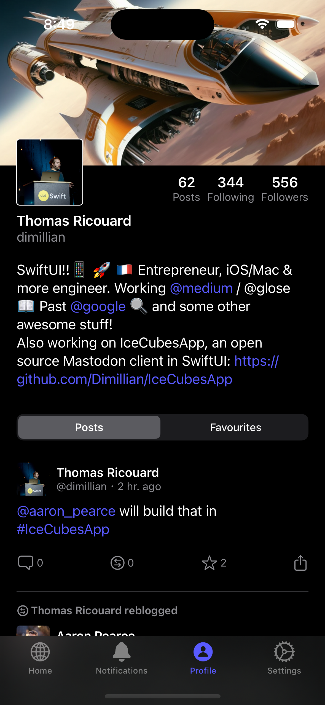
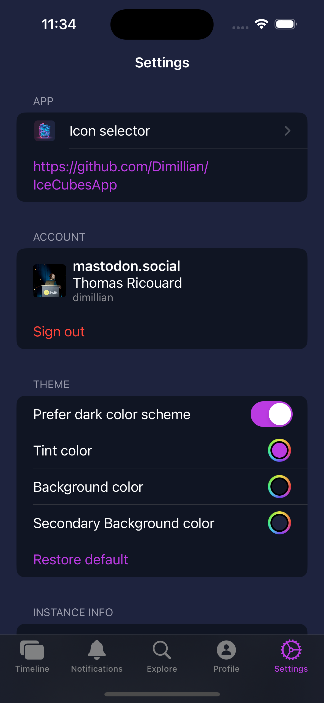
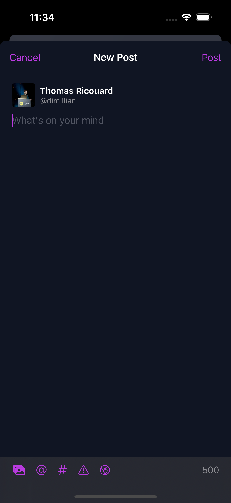

# IceCubesApp

[Public TestFlight beta](https://testflight.apple.com/join/tqI3dK1u) (A proper App Store release will come eventually)

    
    

    
    

    
    

For contributors and myself, here is a todo list of features that could be added (while giving you a good idea of what's already done if not in this list, the app is quite complete already!)

- [ ] Editor: Add / Edit polls
- [ ] Editor: Support video types
- [ ] Editor: Add photos from camera
- [ ] Editor: Support custom emojis
- [ ] Edit profile
- [ ] Handle emoji in status
- [ ] Display & Edit server side features (filter, default visibility, etc...)
- [ ] Edit filters.
- [ ] More context menu everywhere
- [ ] Support IceCubesApp://any mastodon links
- [ ] Translate button
- [ ] Proper iPad support
- [ ] macOS support

IceCubesApp is an open source application for accessing the decentralized social network Mastodon! It's built entirely in SwiftUI, making it fast, lightweight, and easy to use.

You can connect to any Mastodon instance and browse your timeline, interact with other users, and post updates and media.

The project is split into different Swift Packages to make it easier to manage and maintain the codebase. Each package is focused on a specific aspect of the application, such as the UI, network communication, or data models. This modular approach allows for easier collaboration and ensures that the code is organized and easy to understand.

It's a great starting point for learning SwiftUI. The app covers many of the basic concepts of SwiftUI, such as building layouts, working with data, and handling user interaction. By exploring the code, you can gain a solid understanding of how to use SwiftUI in your daily life. Plus, the open source nature of IceCubesApp means that you can see how real-world applications are built and get a sense of best practices for using SwiftUI.

The architecture is straighforward MVVM for most parts, no redux on this one ;)

Please note that IceCubesApp is currently in an early stage of development and as such, there are many features that are still missing. While the app is functional and can be used to browse and interact with Mastodon, there are still many features that are planned for the future.

Thanks!

