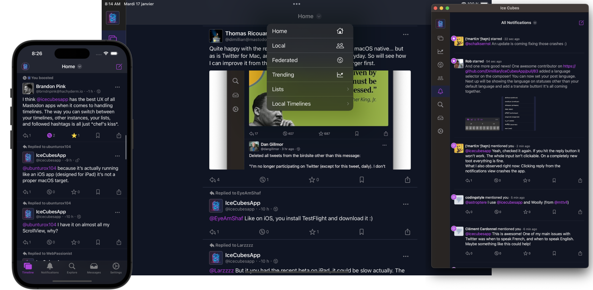

# IceCubesApp

[You can now download it on the App Store](https://apps.apple.com/us/app/ice-cubes-for-mastodon/id6444915884)

IceCubesApp is an open source application for accessing the decentralized social network Mastodon! It's built entirely in SwiftUI, making it fast, lightweight, and easy to use.

You can connect to any Mastodon instance and browse your timeline, interact with other users, and post updates and media.

The project is split into different Swift Packages to make it easier to manage and maintain the codebase. Each package is focused on a specific aspect of the application, such as the UI, network communication, or data models. This modular approach allows for easier collaboration and ensures that the code is organized and easy to understand.

It's a great starting point for learning SwiftUI. The app covers many of the basic concepts of SwiftUI, such as building layouts, working with data, and handling user interaction. By exploring the code, you can gain a solid understanding of how to use SwiftUI in your daily life. Plus, the open source nature of IceCubesApp means that you can see how real-world applications are built and get a sense of best practices for using SwiftUI.

The architecture is straightforward MVVM for most parts, no redux on this one ;)

Please note that IceCubesApp is currently in an early stage of development and as such, there are many features that are still missing. While the app is functional and can be used to browse and interact with Mastodon, there are still many features that are planned for the future.

Thanks!

## Building the project

To build the project, you need to clone the repo and create a copy of the included `.xcconfig` file to create your config before you can compile the project. **Otherwise, you will get an error.**

Here are the steps:

1. Clone the repo
2. In the same folder that contains the `IceCubesApp.xcconfig.template`, run this command:
 - cp IceCubesApp.xcconfig.template IceCubesApp.xcconfig
3. Fill in the `DEVELOPMENT_TEAM` and `BUNDLE_ID_PREFIX` values. The first should have your Apple Team ID (which you can find by logging into the Apple Developer Portal). The latter is your domain in reverse notation or whatever you use as the prefix for your projects.
4. Save your changes, and then you should be able to compile the project without any issues.
