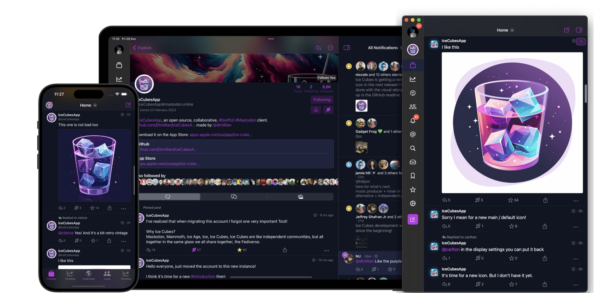

# IceCubesApp

[](https://apps.apple.com/us/app/ice-cubes-for-mastodon/id6444915884)




IceCubesApp is an open-source application for accessing the decentralized social network Mastodon! It's built entirely in SwiftUI, making it fast, lightweight, and easy to use.

You can connect to any Mastodon instance, browse your timeline, interact with other users, and post updates and media.

## Features

### Timeline


* A navigation bar title menu lets you easily swap between your home, local, federated, and trending timeline.
* You can also easily access your lists, followed tags, and tag groups.
* Tag groups are custom timelines made of multiple tags, a feature unique to Ice Cubes.
* You can also add a remote local timeline. A helpful feature to browse the public timeline of other instances. Another Ice Cubes only feature.
* Ice Cubes rely heavily on the streaming events of Mastodon to do stuff like showing new posts live in the home timeline and editing and deleting your posts.
* The timeline sync is semi-automatic; your position is sent to the Mastodon marker API, and from another device running Ice Cubes, you can resume your home timeline position.
* The home timeline is cached using the third-party library [Bodega](https://github.com/mergesort/Bodega). A lite SQLite wrappers. The current position is saved in user default, so when you switch accounts or launch the app, your cached home timeline and position are restored. Then new posts will be fetched and displayed with an unread counter.

`Code` -> Status & Timeline package

### Notifications


* Full support for push notifications.
* Ice Cubes runs its proxy between Mastodon and APNS, which is necessary for Mastodon to route push notifications to the user's device.
* Push notifications are never and can't be read by the proxy.
* Push notifications content/body is decoded on the device. Look for `NotificationServiceSupport`
* Push notifications are rich, and use Apple INSendMessageIntent API for contact pictures.
* Push notifications are grouped by activities, like mentions, favorites, boosts, etc...
* Notifications within the app are also grouped/stacked.
* You can select which kind of push notifications you want to receive within the app.
* Route to the correct post and switch to the proper account when taping notifications.


`Code` -> Notifications package and NotificationService extension.

### Explore / Search

### Direct Messages

### Multi Accounts

The project is split into different Swift Packages to make managing and maintaining the codebase easier. Each package focuses on a specific application aspect, such as the UI, network communication, or data models. This modular approach allows for easier collaboration and ensures the code is organized and easily understood.

It's a great starting point for learning SwiftUI. The app covers many of the basic concepts of SwiftUI, such as building layouts, working with data, and handling user interaction. By exploring the code, you can understand how to use SwiftUI in your daily life. Plus, the open-source nature of IceCubesApp means you can see how real-world applications are built and get a sense of best practices for using SwiftUI.

The architecture is straightforward MVVM for most parts, there is no redux on this one ;)

Thanks!


## Building the project

To build the project, you need to clone the repo and create a copy of the included `.xcconfig` file to create your config before you can compile the project. **Otherwise, you will get an error.**

Here are the steps:

1. Clone the repo
2. In the same folder that contains the `IceCubesApp.xcconfig.template`, run this command:

```bash
cp IceCubesApp.xcconfig.template IceCubesApp.xcconfig
```

3. Fill in the `DEVELOPMENT_TEAM` and `BUNDLE_ID_PREFIX` values. The first should have your Apple Team ID (which you can find by logging into the Apple Developer Portal). The latter is your domain in reverse notation or whatever you use as the prefix for your projects.
4. Save your changes, and then you should be able to compile the project without any issues.
