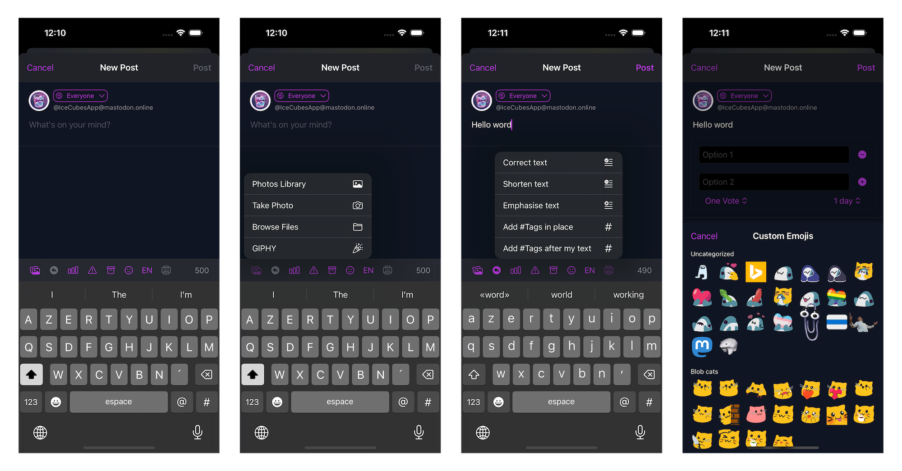
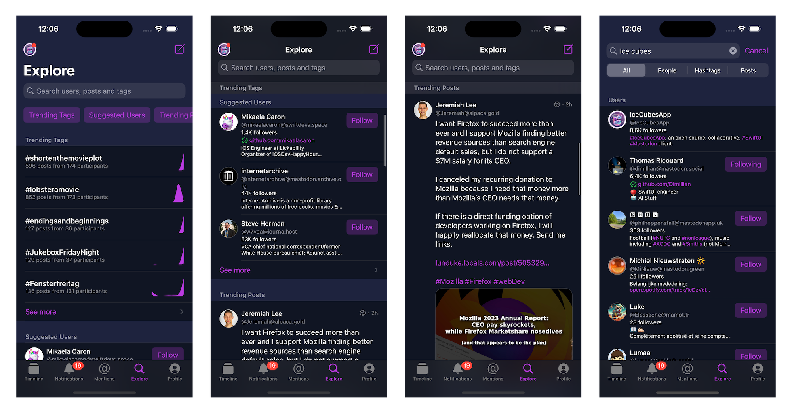
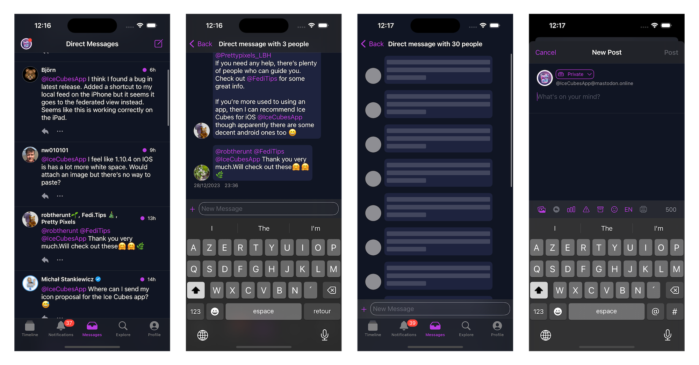
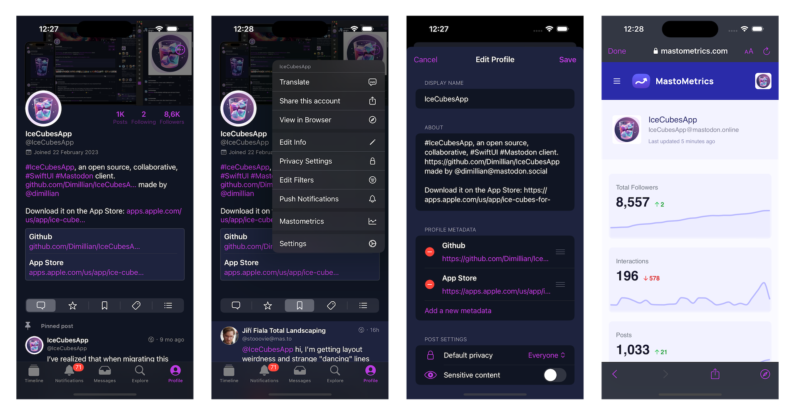
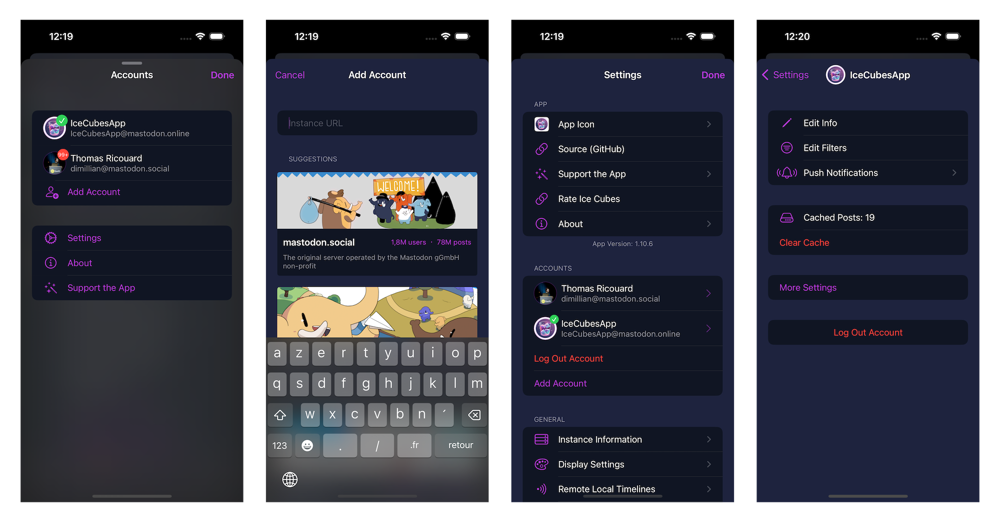
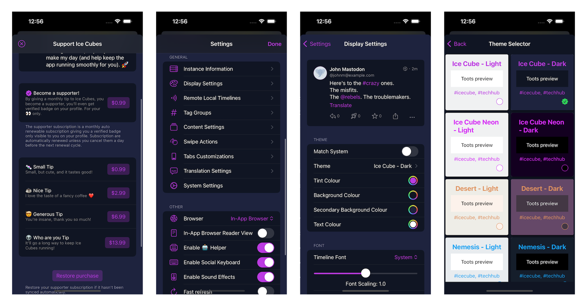

# IceCubesApp

[](https://apps.apple.com/us/app/ice-cubes-for-mastodon/id6444915884)

<a href="https://www.emergetools.com/app/example/ios/com.thomasricouard.IceCubesApp/release?utm_campaign=badge-data"></a>
<a href="" rel="nofollow"></a>
[](https://www.gnu.org/licenses/agpl-3.0)


IceCubesApp is an open-source application for accessing the decentralized social network Mastodon! It's built entirely in SwiftUI, making it fast, lightweight, and easy to use.

You can connect to any Mastodon instance, browse your timeline, interact with other users, and post updates and media.

It's multiplatform and works on iOS, macOS, iPadOS, and visionOS.
It has a dedicated UI with a sidebar on macOS and iPadOS.

## Features

### Timeline


* A navigation bar title menu lets you easily swap between your home, local, federated, and trending timeline.
* You can also easily access your lists, followed tags, and tag groups.
* Tag groups are custom timelines made of multiple tags, a feature unique to Ice Cubes.
* Quote post!
* You can also add a remote local timeline. A helpful feature to browse the public timeline of other instances. Another Ice Cubes only feature.
* Ice Cubes relies heavily on the streaming events of Mastodon to do stuff like showing new posts live in the home timeline and editing and deleting your posts.
* The timeline sync is semi-automatic; your position is sent to the Mastodon marker API, and from another device running Ice Cubes, you can resume your home timeline position.
* The home timeline is cached using the third-party library [Bodega](https://github.com/mergesort/Bodega). A lite SQLite wrappers. The current position is saved in user default, so when you switch accounts or launch the app, your cached home timeline and position are restored. Then new posts will be fetched and displayed with an unread counter.
* iCloud sync of tag groups, remote timelines and drafts.
* Server side filters support.
* Create and switch to your lists.

`Code` -> Status & Timeline package

### Editor / Composer



* Full-featured post editor.
* You can write threads up to 5 posts.
* Upload up to 4 images.
* AI-assisted tools using OpenAI API for text correction, hashtag generation, and more.
* Generate image description using AI!
* Custom emojis support.
* Add polls and content warnings.
* Save/restore from drafts.
* Use the Apple language detection feature to suggest the language before posting.

`Code` -> Status package -> StatusEditor component
`Code` -> OpenAIClient

### Notifications


* Full support for push notifications.
* Ice Cubes runs its proxy between Mastodon and APNS, which is necessary for Mastodon to route push notifications to the user's device.
* Push notifications are never and can't be read by the proxy.
* Push notifications content/body is decoded on the device. Look for `NotificationServiceSupport`
* Push notifications are rich, and use Apple INSendMessageIntent API for contact pictures.
* Push notifications are grouped by activities, like mentions, favorites, boosts, etc...
* Notifications within the app are also grouped/stacked.
* You can select which kind of push notifications you want to receive within the app.
* Route to the correct post and switch to the proper account when taping notifications.


`Code` -> Notifications package and NotificationService extension.

### Explore / Search



* Dedicated explore/search tab for trending users, tags, posts, and links.
* Easy access to all those categories from the top area.
* You can search for everything or filter by users, tags, and posts.
* See a graph for the activities on the trending tags.
* See more from each category to access the full-screen view.

`Code` -> Explore package

### Direct Messages



* Dedicated tab for direct/private messages.
* Chat like UI
* You can use the inline composer for a quick chat or the full editor.

`Code` -> Conversations package

### Profile



* Rich profile support.
* Fully access & tweak your privacy settings.
* Edit your profile, from your bio to your custom fields.
* Easy access to Mastometrics.
* Add a custom server-side note visible only to you for any profile.
* Translate the bio of any profile to your language.
* Easy access to edit your server-side timeline filters.
* Easy access to share your profile outside of the app.

`Code` -> Account package

### Multi Accounts



* Support for an unlimited number of Mastodon accounts.
* Easily browse/discover instances and log in!
* Swap account from any screen on iOS.
* Swap your account from the macOS/iPadOS sidebar with just one click.
* Full server-side and client-side account settings support.
* Swipe to delete an account from the settings.
* Safe authentication using Apple's `WebAuthenticationSession`
* The account token is securely stored in the keychain.

`Code` -> Account & AppAcount packages

### Other



* You can support this project with tips in the app and Github sponsoring.
* Massive amount of customization settings.
* You can tweak the display settings like the font, line spacing, status actions buttons, etc...
* Many built-in themes.
* Make your theme.
* Customize your swipe gestures.
* Customize your tabbar entries.
* Sound & haptic feedback support.

## A note on the architecture

The project is split into different Swift Packages to make managing and maintaining the codebase easier. Each package focuses on a specific application aspect, such as the UI, network communication, or data models. This modular approach allows for easier collaboration and ensures the code is organized and easily understood.

It's a great starting point for learning SwiftUI. The app covers many of the basic concepts of SwiftUI, such as building layouts, working with data, and handling user interaction. By exploring the code, you can understand how to use SwiftUI in your daily life. Plus, the open-source nature of IceCubesApp means you can see how real-world applications are built and get a sense of best practices for using SwiftUI.

The architecture is straightforward MVVM for most parts, there is no redux on this one ;)

Thanks!


## Building the project

To build the project, you need to clone the repo and create a copy of the included `.xcconfig` file to create your config before you can compile the project. **Otherwise, you will get an error.**

Here are the steps:

1. Clone the repo
2. In the same folder that contains the `IceCubesApp.xcconfig.template`, run this command:

```bash
cp IceCubesApp.xcconfig.template IceCubesApp.xcconfig
```

3. Fill in the `DEVELOPMENT_TEAM` and `BUNDLE_ID_PREFIX` values. The first should have your Apple Team ID (which you can find by logging into the Apple Developer Portal). The latter is your domain in reverse notation or whatever you use as the prefix for your projects.
4. Save your changes, and then you should be able to compile the project without any issues.
